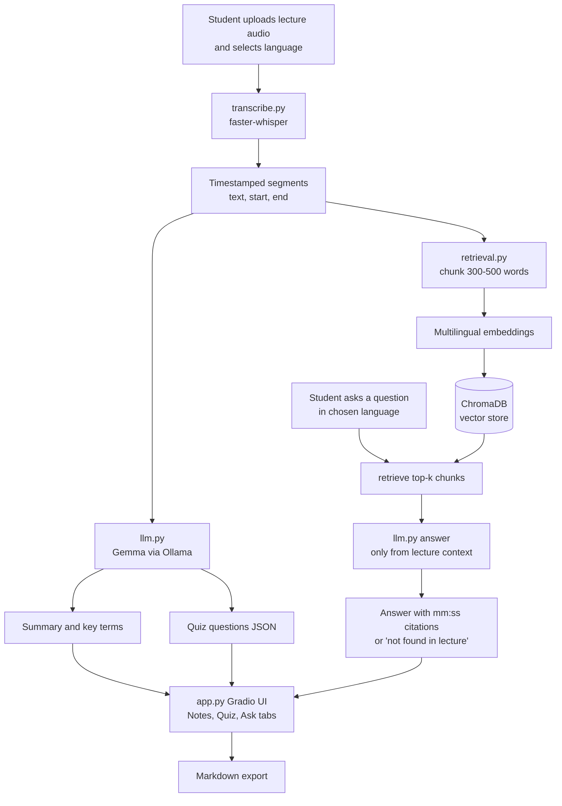

# Lecturelens

> Your lecture, searchable and explained in your own language

## Team

**Team Name:** 404BLUE


| Member | Contribution   |
| ------ | -------------- |
| Sanjay Vijay | faster-whisper, timestamps, language setting, transcript cleanup |
| Sujithbabu S S | Chunking, embeddings, ChromaDB, search function with timestamp metadata |
| Vishal P | Ollama setup, summary, key terms, quiz, Q&A prompt, multilingual answers |
| S J Bavishnu | Gradio app, repo and Git workflow, README, demo video, deployment, pitch |


## Problem Statement

### The Problem

Lectures are long, hard to search, and often mix English with a local language, which makes revision harder than it should be. Lecturelens lets you upload a lecture recording and get a transcript with timestamps, a summary, key terms, and a quiz. You can then ask questions in your chosen language, and every answer is drawn only from what was said in the lecture, with timestamp citations so you can jump straight to the source.

### Why We Chose This Problem

Useful explanations happen in lectures, then vanish into recordings nobody has time to replay. Revision is where learning consolidates, yet it's where students get the least support. When lectures switch between English and a regional language, the students who most need clarity often get the least of it.
Finding the exact moment a concept was explained, and asking follow-up questions in their own language, helps students understand instead of memorizing fragments. Lecturelens runs fully on open-source tools and stays on the student's machine, so it's realistic for low-budget colleges and privacy-conscious students.

## Solution

Lecturelens turns any lecture recording into a searchable study resource. A student uploads an audio file or lecture pdf, picks the lecture's language, and receives a timestamped transcript, a summary, key terms, and a quiz. They can then ask questions in their own language, and each answer comes only from what the lecture covered, with timestamp citations pointing to the exact moment. If the lecture doesn't address a question, Lecturelens says so rather than guessing.

### Key Features

- Transcription with timestamps: Converts lecture audio into text using faster-whisper, with each segment linked to its position in the recording.
- Summary and key terms: Generates a concise overview and a list of important concepts for quick revision.
- Grounded Q&A in your language: Answers questions using only the lecture content, in the language you select, with mm:ss timestamp citations.
- Auto-generated quiz: Creates questions from the lecture so students can check their understanding.

## Innovation and Differentiation

Most lecture tools stop at transcription, leaving students to search a wall of text by hand. Lecturelens lets them question the lecture instead. Answers come only from the recording, cite the exact timestamp, and are given in the student's chosen language. If the lecture doesn't cover a question, Lecturelens says so.
Generic AI assistants draw on the broad internet, so they can give confident answers that don't match what the professor taught. Lecturelens keeps answers tied to the course material, and it runs locally on open-source tools, so recordings never leave the student's machine.

## Technical Implementation

### Architecture



### Technology Stack

| Category        | Technologies                |
| --------------- | --------------------------- |
| Frontend        | Python using Gradio       |
| Backend         | Python Moddules      |
| Database        | Chroma DB        |
| AI / ML         | faster-whisper (transcription), Gemma 4 E4B via Ollama (E2B as backup), multilingual sentence-transformers (embeddings)|
| Infrastructure  | Python 3.10+, ChromaDB (vector store), Gradio (UI), runs locally; optional Hugging Face Spaces hosting        |
| APIs / Services | None required; all components are open source and run locally via Ollama            |


### How It Works

System components and how they interact

Lecturelens is a pipeline of four Python modules, each owned by one team member, tied together by a Gradio interface.

transcribe.py uses faster-whisper to turn the uploaded audio into timestamped segments, caching results to JSON so a recording is never transcribed twice.

retrieval.py groups segments into chunks of about 300 to 500 words, embeds them with a multilingual model, and stores them in ChromaDB with start and end times. For a question, it returns the most relevant chunks.

llm.py runs Gemma through Ollama to produce the summary, key terms, and quiz, and to answer questions from the retrieved chunks only, with timestamp citations in the chosen language.

app.py is the Gradio interface with Notes, Quiz, and Ask tabs. It connects the modules, shows progress and friendly errors, and provides the Markdown export.

Setup runs once per lecture: transcribe, index, then generate notes. After that, each question triggers one retrieval step and one model call. Each module has a fixed interface, so any one can be improved without touching the others.

### Technical Decisions

Modular design: Four independent modules (transcription, retrieval, LLM, UI) connect through fixed function contracts, with stubs written first so the team could build in parallel.
Local open-source stack: faster-whisper, ChromaDB, Ollama, and Gradio keep audio private, cost nothing, and work offline.
Timestamps throughout: Segment timing is preserved from transcription to retrieval, so answers can point to the exact moment in the lecture.

RAG: The transcript is chunked, embedded, and searched (top 4 chunks), which fits long lectures into a small model's context and keeps answers grounded.

Multilingual support: A multilingual embedding model lets Malayalam, Hindi, and English questions and content match each other.

Grounded answers: The prompt restricts the model to the retrieved context and includes a "not found" response to reduce hallucination.

Performance: faster-whisper, caching, and short demo clips keep it responsive on modest hardware.

Process: One file per owner, an integration checkpoint at 2:30, and a feature freeze at 4:00 kept the project on track.

Accepted trade-offs: A small local LLM is less capable, Malayalam transcription is less accurate, and quiz quality is limited.

## Implementation During the Hackathon

Transcription: Audio upload and speech-to-text with faster-whisper, with timestamps and a language option (English, Hindi, Malayalam).

Retrieval (RAG): Transcript chunking, multilingual embeddings, and a ChromaDB index that returns the most relevant passages with their timestamps.

LLM features: Using Ollama, we built summaries, key terms, multiple-choice quizzes, and question answering grounded in the lecture, with multilingual answers and 
a "not found" response.

User interface: A Gradio web app that connects the full flow (upload, transcribe, index, ask) and includes an export button.

Delivery: A shared Git repo with commits from all four members, a README, a backup demo video, and a deployed demo.

### Team Contributions

| Member | Contribution   |
| ------ | -------------- |
| Sanjay Vijay | faster-whisper, timestamps, language setting, transcript cleanup |
| Sujithbabu S S | Chunking, embeddings, ChromaDB, search function with timestamp metadata |
| Vishal P | Ollama setup, summary, key terms, quiz, Q&A prompt, multilingual answers |
| S J Bavishnu | Gradio app, repo and Git workflow, README, demo video, deployment, pitch |

## Working Application

**Live Application:** [Live URL]

Upload audio: Add a lecture clip (English, Hindi, or Malayalam) and select its language.

Transcript: View the transcription with timestamps.

Summary and key terms: Generate study notes from the lecture.

Quiz: Generate multiple-choice questions with answers.

Ask questions: Type a question in any supported language and get an answer grounded in the lecture, with the timestamp of the source.

Not-found handling: Ask something the lecture doesn't cover and it should say the answer isn't there.

Export: Download the notes.

The submitted application should be functional and accessible through the provided link where applicable.

## Demo Video

**Demo Video:** https://youtu.be/4s3nafAAV2A

## Open Source and AI Usage

### AI / Models

- **Antigravity:** Vibe Coding 
  **Claude:** Structuring Presentation

### Open Source Components

- **[Library / Framework]:** [Purpose]
- **[Dataset]:** [Purpose]
- **[API / Service]:** [Purpose]

[Include relevant licenses, attribution, and acknowledgements for external components.]

## Setup and Usage

### Prerequisites

- [Requirement]
- [Requirement]

### Installation

```bash
git clone https://github.com/bavishnu11/hacktoberfest-hack-day-coimbatore-x-init-club-and-idea-club
cd hacktoberfest-hack-day-coimbatore-x-init-club-and-idea-club
python -m venv venv
source venv/bin/activate        
pip install -r requirements.txt
```

### Environment Variables

```env
# Ollama
OLLAMA_HOST=http://localhost:11434
OLLAMA_MODEL=gemma4:e4b

# Whisper
WHISPER_MODEL_SIZE=small
WHISPER_DEVICE=cpu
WHISPER_COMPUTE_TYPE=int8

# Embeddings
EMBEDDING_MODEL=paraphrase-multilingual-MiniLM-L12-v2

# ChromaDB
CHROMA_PERSIST_DIR=./chroma_db

# Cache
CACHE_DIR=./cache
```


### Running the Project

```bash
.\start.sh
```

### Usage

[Explain the basic steps required to use the project.]

## Devpost Submission

**Devpost Project:** [Devpost Project URL]

[Add the link to the team's Devpost submission. Ensure the Devpost project page is complete and contains the required project information, links, media, and team details.]

## Credits and License

### Credits

[Credit libraries, frameworks, datasets, models, APIs, contributors, and other external resources used.]

### License

[License name and/or link.]

## Submission Checklist

- [X] Project title and description added
- [X] All team members listed
- [X] Problem clearly explained
- [x] Reason for choosing the problem explained
- [X] Solution and key features documented
- [x] Innovation and differentiation explained
- [X] Architecture included
- [X] Technical implementation documented
- [X] Work completed during the hackathon documented
- [ ] Team contributions documented
- [ ] Working application is functional
- [ ] Live application link added where applicable
- [ ] Demo video added
- [ ] AI and open-source components documented
- [ ] Setup and usage instructions tested
- [ ] Challenges and learnings documented
- [ ] Devpost submission completed
- [ ] Devpost link added
- [ ] Credits added
- [ ] License added
- [ ] Repository is organized and complete
